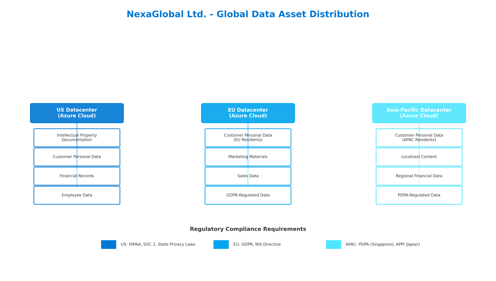
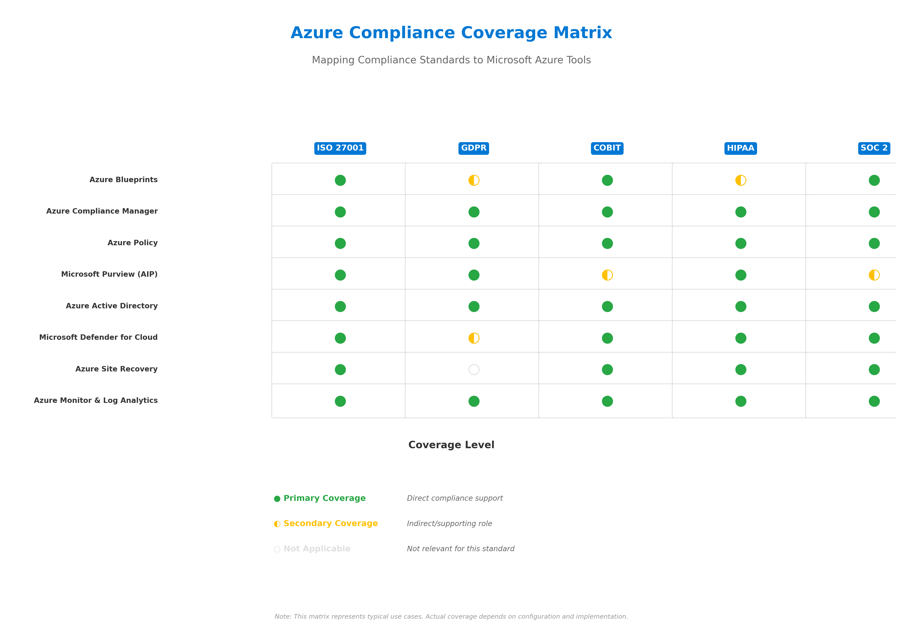

# Azure Cloud Compliance Strategy for NexaGlobal Ltd.

> **Context**: This case study is the final project of [Cybersecurity Management and Compliance](https://www.coursera.org/learn/cybersecurity-management-and-compliance) by Microsoft on Coursera. The course covers cloud security planning, security requirements for cloud architecture, Microsoft's privacy principles, and compliance management tools — key foundations for the Microsoft SC-900 certification. A comprehensive compliance strategy was developed for a simulated fintech startup (NexaGlobal Ltd.) migrating to Microsoft Azure.

## Project Overview

**Organization**: NexaGlobal Ltd. (simulated multinational fintech firm)  
**Challenge**: Strengthen compliance posture for digital assets distributed across US, EU, and Asia-Pacific Azure datacenters  
**Objective**: Develop a comprehensive compliance strategy leveraging Microsoft Azure's security and compliance ecosystem

## Deliverables

| Document | Description |
|----------|-------------|
| [01. Organizational Context](docs/01-organizational-context.md) | Scenario overview, digital asset distribution, and compliance objectives |
| [02. Cloud Security Planning](docs/02-cloud-security-planning.md) | Identity management (Azure AD, MFA), disaster recovery (Azure Site Recovery), and security training |
| [03. Azure CAF Alignment](docs/03-azure-caf-alignment.md) | Cloud Adoption Framework implementation for secure, scalable cloud transformation |
| [04. Data Management](docs/04-data-management.md) | ETL orchestration (Azure Data Factory) and policy enforcement (Azure Policy) |
| [05. Availability & Continuity](docs/05-availability-continuity.md) | Geo-replication strategy, SLA design, and disaster recovery planning |
| [06. Compliance Management](docs/06-compliance-management.md) | Azure Blueprints, Compliance Manager, and alignment with ISO 27001, COBIT, ISMA |
| [07. Insider Risk Management](docs/07-insider-risk-management.md) | Microsoft Insider Risk tools, behavioral analytics, and mitigation strategies |
| [08. Information Protection](docs/08-information-protection.md) | Azure Information Protection (AIP), data classification, and lifecycle management |
| [09. Documentation & Reporting](docs/09-documentation-reporting.md) | Centralized documentation, automated compliance reporting, and dashboards |

## What This Project Demonstrates

- **Cloud Security Architecture**: Designing identity, access, and disaster recovery controls for Azure environments
- **Data Sovereignty & Compliance**: Managing multi-jurisdictional data with GDPR, HIPAA, PDPA requirements
- **Microsoft Compliance Tooling**: Practical application of Azure Blueprints, Compliance Manager, Purview, Defender for Cloud
- **Governance Frameworks**: Aligning cloud operations with ISO 27001, COBIT, and industry best practices
- **Risk Management**: Addressing insider threats, data lifecycle, and continuous monitoring
- **Consultant Deliverable Quality**: Structured recommendations with actionable implementation guidance

## Key Visuals

### Global Data Asset Distribution

### Azure Compliance Coverage Matrix

## 🛠️ Technologies & Frameworks

**Microsoft Azure Services**:
- Azure Active Directory (Entra ID)
- Azure Blueprints & Azure Policy
- Azure Compliance Manager
- Microsoft Purview (Azure Information Protection)
- Microsoft Defender for Cloud
- Azure Site Recovery
- Azure Data Factory
- Azure Monitor & Log Analytics

**Compliance Frameworks**:
- ISO 27001
- COBIT
- GDPR, HIPAA, PDPA (Singapore), SOC 2

## Skills Applied

- Cloud security planning and architecture
- Compliance management and audit preparation
- Data governance and lifecycle management
- Identity and access management (IAM)
- Disaster recovery and business continuity planning
- Risk assessment and mitigation
- Technical documentation and stakeholder communication

---

