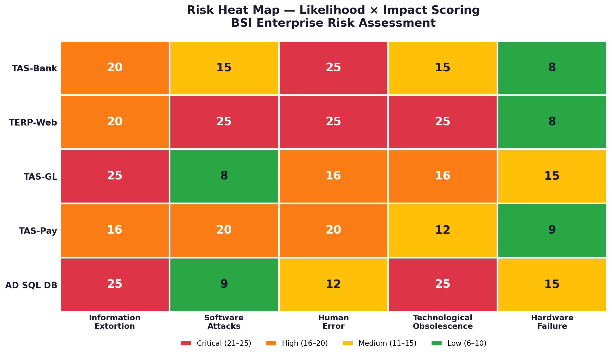
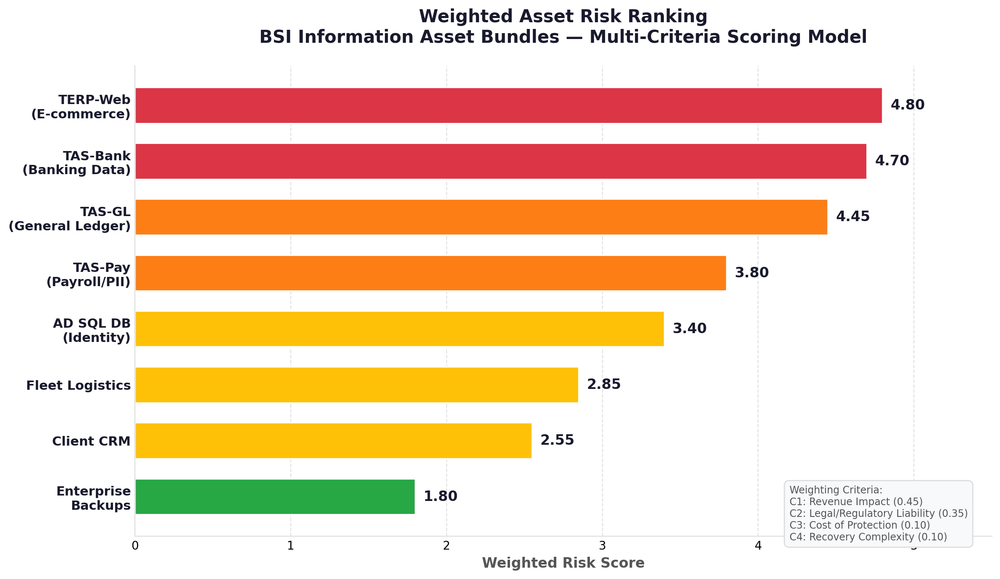

# ISO 27001 Risk Management — BSI Case Study

> Enterprise risk assessment and treatment plan for a regional office supply retailer, applying ISO/IEC 27001 and a quantitative multi-criteria risk scoring methodology.

---

## Scenario

Business Supplies, Inc. (BSI) is a regional office supply retailer with 5 stores, a corporate headquarters, and a fleet of 20 delivery trucks. After the retirement of its co-founders, the new CEO initiated IT modernization — but the organization has **no formal information security policies, no dedicated security staff, and aging infrastructure** running critical financial and identity systems.

**The challenge:** Transform BSI's reactive, informal security posture into a structured, sustainable Governance, Risk & Compliance (GRC) operating model.

## What This Project Demonstrates

- Designed a **quantitative weighted risk scoring model** evaluating 23 technical assets across 4 criteria (revenue impact, legal liability, reputational impact, operational continuity)
- Consolidated assets into **8 executive-level business bundles** for governance reporting
- Conducted **threat landscape analysis** ranking 12 specific threats into 5 weighted categories
- Built a **5×5 risk matrix** identifying 6 critical red-zone intersections (score = 25)
- Developed a **12-month remediation roadmap** with projected >40% critical risk reduction
- Mapped risk treatments to **ISO 27001 Annex A** controls
- Conducted a **framework selection analysis** (ISO 27001 vs. NIST CSF) with weighted cost-benefit evaluation, recommending ISO 27001 as a competitive differentiator

## Frameworks & Standards

- **ISO/IEC 27001:2022** — Information Security Management System (ISMS)
- **ISO/IEC 27005** — Information Security Risk Management
- **ISO 27001 Annex A** — Control mapping

## Deliverables

| Document | What It Covers |
|----------|---------------|
| [Organizational Context](./docs/01-organizational-context.md) | BSI profile, current security gaps, framework selection rationale |
| [Risk Assessment Methodology](./docs/02-risk-assessment-methodology.md) | Weighted scoring model, criteria definitions, risk lifecycle |
| [Asset Identification & Bundling](./docs/03-asset-identification.md) | 23-asset inventory → 8 strategic bundles with scoring |
| [Threat Analysis](./docs/04-threat-analysis.md) | 12 threat scenarios → 5 weighted categories |
| [Risk Matrix](./docs/05-risk-matrix.md) | 5×5 Likelihood × Impact heatmap with critical findings |
| [Risk Treatment Plan](./docs/06-risk-treatment-plan.md) | ISO 27001 Annex A control mapping and governance model |
| [Remediation Roadmap](./docs/07-remediation-roadmap.md) | 12-month phased implementation plan |
| [Framework Selection Analysis](./docs/08-framework-selection-analysis.md) | ISO 27001 vs. NIST CSF — cost-benefit analysis and strategic rationale |

##  Key Visuals

### Risk Heat Map

### Weighted Asset Ranking

## Key Findings

- **TERP-Web (E-commerce platform)** ranked as highest-risk asset — combined PCI exposure and direct revenue dependency (weighted score: 4.80/5.00)
- **6 critical red-zone intersections** identified (score = 25), concentrated in:
  - Human Error × Banking Data
  - Software Attacks × E-commerce Platform
  - Obsolescence × Identity Infrastructure (AD SQL DB)
- **Top 3 enterprise threats:** Information Extortion (ransomware), Human Error (phishing/social engineering), Software Attacks
- **AD SQL DB** flagged as single point of failure for enterprise identity management

##  Analytical Approach

This project applies a **quantitative, economics-informed approach** to cybersecurity risk — using weighted multi-criteria scoring rather than qualitative judgment alone. Assets were evaluated at granular level (23 individual assets) then aggregated into business-aligned bundles for executive communication.

This methodology reflects enterprise risk practices used in advisory and audit engagements, where structured quantitative analysis supports defensible, evidence-based decision-making.

>  *This case study was developed as part of a cybersecurity risk management course, applying ISO 27001 principles to a realistic organizational scenario.*
