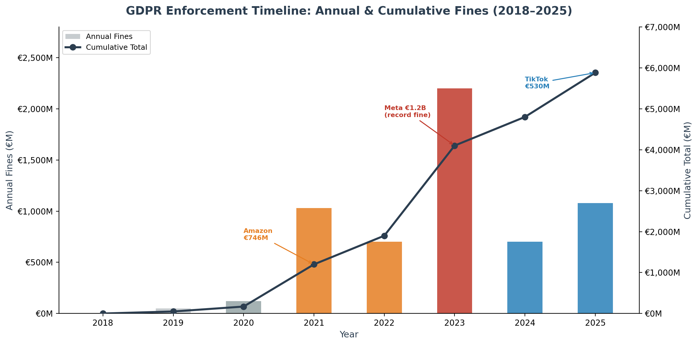
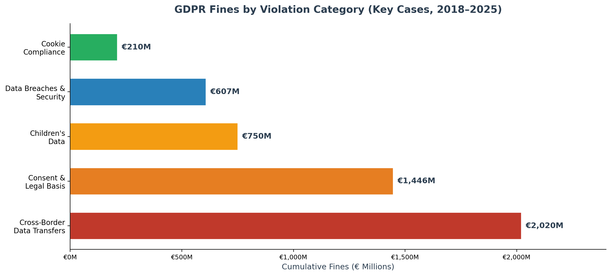

# GDPR Enforcement Analysis

> A review of major GDPR enforcement actions (2018–2025), analyzing violation patterns, regulatory trends, and practical compliance lessons for enterprises — including a discussion of cloud service provider compliance tooling and the shared responsibility model.

---

## Objective

Provide enterprises with an evidence-based understanding of **how GDPR is actually enforced**, what conduct triggers the largest penalties, and what organizational measures can mitigate regulatory risk — including the role (and limits) of cloud compliance tools.

## Context

Since May 2018, EU Data Protection Authorities have imposed over **€5.88 billion** in GDPR fines. This project analyzes the top enforcement cases to extract actionable patterns for compliance programs.

## Key Findings

| Violation Pattern | Largest Fine | Total (Key Cases) | Trend |
|---|---|---|---|
| Cross-border data transfers | €1.2B (Meta, 2023) | €2,020M | Highest risk — post-Schrems II |
| Consent & legal basis | €746M (Amazon, 2021) | €1,446M | Persistent — dark patterns targeted |
| Children's data | €405M (Instagram, 2022) | €750M | Increasing regulatory focus |
| Data breaches & security | €265M (Meta, 2022) | €607M | Preventable with basic hygiene |
| Cookie compliance | €90M (Google, 2021) | €210M | CNIL leading enforcement |

### Enforcement Timeline

### Fines by Violation Category

## 💡 Key Insight: Cloud ≠ Compliance

A recurring pattern across enforcement cases is the assumption that hosting data on a major cloud platform (Azure, AWS) equates to GDPR compliance. **It does not.**

Under the **shared responsibility model**, cloud service providers secure the *infrastructure* — but the **data controller remains fully liable** for how personal data is processed, stored, and transferred. The tooling exists; the accountability cannot be outsourced.

| Layer | CSP Provides | Controller Must Own |
|---|---|---|
| Infrastructure security | ✅ Managed | — |
| Encryption & data residency | ✅ Available | ✅ Must enable & configure |
| Lawful basis & consent | — | ✅ Full responsibility |
| DPIA & breach notification | Tools available | ✅ Must execute |
| Data subject rights | APIs available | ✅ Must implement processes |

> *Meta's €1.2B fine (2023) is the clearest example: the infrastructure was compliant — the transfer governance was not.*

➡️ Full analysis with Azure vs. AWS comparison in [Enforcement Case Analysis](docs/02-enforcement-case-analysis.md#cloud-compliance-tooling)

---

## Deliverables

| # | Document | Description |
|---|----------|-------------|
| 1 | [GDPR Legal Framework](docs/01-gdpr-legal-framework.md) | Structured reference covering GDPR principles, data subject rights, and organizational obligations |
| 2 | [Enforcement Case Analysis](docs/02-enforcement-case-analysis.md) | Case analysis by violation pattern, cloud compliance tooling comparison (Azure vs. AWS), shared responsibility model, and enterprise compliance checklist |

## Frameworks & References

- **EU GDPR** (Regulation EU 2016/679) — Articles 5, 6, 7, 12–22, 25, 30, 32–34, 44–49
- **Schrems II** (CJEU C-311/18, 2020) — invalidation of Privacy Shield
- **EU-US Data Privacy Framework** (2023) — new adequacy decision
- **ePrivacy Directive** (2002/58/EC) — cookie consent requirements

## Data Sources

- [CMS GDPR Enforcement Tracker](https://www.enforcementtracker.com/)
- [Statista — Largest GDPR Fines](https://www.statista.com/statistics/1133337/largest-fines-issued-gdpr/)
- [Data Privacy Manager — Top 20 Fines](https://dataprivacymanager.net/5-biggest-gdpr-fines-so-far-2020/)
- [Skillcast — Biggest GDPR Fines 2025](https://www.skillcast.com/blog/20-biggest-gdpr-fines)
- [Infosecurity Magazine — Top 10 Fines 2025](https://www.infosecurity-magazine.com/news-features/top-10-data-breach-fines-2025/)

## What This Project Demonstrates

| Competency | Evidence |
|---|---|
| **GDPR knowledge** | Structured legal framework covering all 6 principles, 8 data subject rights, and organizational obligations |
| **Enforcement awareness** | Analysis of 10+ major cases across 5 violation categories with specific article references |
| **Analytical thinking** | Pattern extraction from enforcement data to derive actionable enterprise lessons |
| **Cloud compliance** | Comparative analysis of Azure vs. AWS compliance tooling with shared responsibility model discussion |
| **Advisory judgment** | Practical compliance checklist derived from real enforcement outcomes |

---

*Part of the GRC & IT Audit Portfolio — Data Protection domain.*
